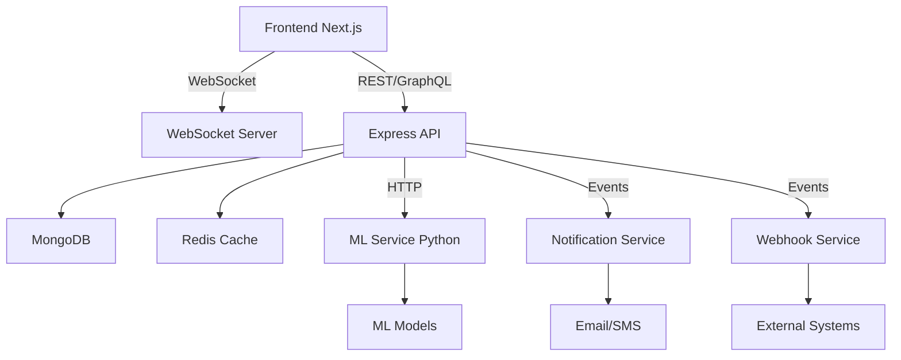

# Additional Features Enhancement Plan

## Overview

Enhance the deepfake detection system with advanced features across analytics, real-time capabilities, export functionality, batch processing, ML integration, and security improvements.

## Feature Categories

### 1. Real-Time & WebSocket Features

#### WebSocket Integration for Live Updates

- **Backend**: Add WebSocket server using Socket.IO or native WebSockets
- **Frontend**: Real-time scan status updates without polling
- **Features**:
  - Live scan progress updates
  - Real-time notifications for completed scans
  - System alerts and health status updates
  - Multi-user collaboration features

**Files to modify:**

- `backend/src/server.js` - Add WebSocket server
- `backend/src/scans/scan.service.js` - Emit WebSocket events during processing
- `components/media-scanner.tsx` - Subscribe to WebSocket events
- `components/tactical-shell.tsx` - Add notification center

### 2. Advanced Analytics & Reporting

#### Analytics Dashboard

- **Time-series charts** for scan trends
- **Verdict distribution** pie/bar charts
- **User activity** analytics
- **Media type distribution** analysis
- **Risk score trends** over time
- **Detection accuracy** metrics (when ML models are integrated)

**New files:**

- `components/admin/analytics-dashboard.tsx`
- `app/analytics/page.tsx` (analyst role)
- `backend/src/admin/analytics.controller.js`
- `backend/src/admin/analytics.service.js`

#### Report Generation

- **PDF reports** with scan details and visual evidence
- **JSON/CSV export** for bulk data analysis
- **Scheduled reports** (daily/weekly/monthly summaries)
- **Custom report templates**

**New files:**

- `backend/src/reports/report.service.js`
- `backend/src/reports/report.controller.js`
- `components/reports/report-generator.tsx`
- `lib/report-utils.ts` (PDF generation using jsPDF/puppeteer)

### 3. Batch Processing

#### Batch Upload & Processing

- **Multiple file upload** at once
- **Folder/zip upload** support
- **Queue management** for processing
- **Priority scheduling** for urgent scans
- **Batch status tracking**

**Files to modify:**

- `backend/src/scans/scan.service.js` - Add batch processing logic
- `backend/src/scans/scan.controller.js` - Handle batch uploads
- `components/media-scanner.tsx` - Add multi-file upload UI
- `backend/src/utils/queue.js` - Queue system (Bull/Redis)

### 4. Advanced Search & Filtering

#### Enhanced Evidence Vault

- **Full-text search** across scan results
- **Advanced filters**: date range, verdict, media type, user, GPS location
- **Saved filter presets**
- **Bulk actions** (delete, export, tag)
- **Tagging system** for organizing scans
- **Similarity search** (find similar deepfakes)

**Files to modify:**

- `components/evidence-vault.tsx` - Enhanced filtering UI
- `backend/src/scans/scan.service.js` - Add search/filter logic
- `backend/src/scans/scan.model.js` - Add tags field
- `backend/src/scans/scan.controller.js` - Enhanced query endpoints

### 5. ML Model Integration Infrastructure

#### ML API Bridge

- **Python Flask/FastAPI** service for ML models
- **Model versioning** support
- **Model A/B testing** framework
- **Confidence threshold** configuration
- **Model performance monitoring**

**New files:**

- `ml-service/app.py` (Python ML service)
- `backend/src/ml/ml-client.js` - ML API client
- `backend/src/config/ml.config.js` - ML service configuration
- `backend/src/agents/detection.agent.js` - Replace mock with real ML calls

#### Model Management UI

- **Model version selection** in admin panel
- **Confidence threshold** adjustment
- **Model performance metrics**
- **Retrain/update model** interface

### 6. Collaboration & Sharing Features

#### Scan Sharing & Comments

- **Share scans** with team members
- **Comments/annotations** on scan results
- **Case management** - group related scans
- **Assign scans** to analysts for review
- **Approval workflow** for critical findings

**Files to modify:**

- `backend/src/scans/scan.model.js` - Add sharing, comments, cases
- `backend/src/scans/scan.service.js` - Sharing logic
- `components/evidence-vault.tsx` - Share/comment UI
- `components/case-manager.tsx` (new)

### 7. Security Enhancements

#### Audit Logging

- **Comprehensive audit trail** for all actions
- **User activity logging**
- **Security event monitoring**
- **Audit log viewer** in admin panel

**New files:**

- `backend/src/audit/audit.service.js`
- `backend/src/audit/audit.model.js`
- `components/admin/audit-log.tsx`

#### Enhanced Security

- **Two-factor authentication (2FA)**
- **IP whitelisting** for admin access
- **Session management** (view active sessions, force logout)
- **Password policy** enforcement
- **API key management** for programmatic access

### 8. Performance & Optimization

#### Caching Layer

- **Redis caching** for frequently accessed data
- **Scan result caching** (deterministic results)
- **User session caching**

**New files:**

- `backend/src/utils/cache.js`
- `backend/src/config/redis.config.js`

#### Image/Video Optimization

- **Thumbnail generation** for videos
- **Image compression** for storage efficiency
- **CDN integration** for media assets
- **Progressive video loading**

### 9. Notification System

#### Multi-channel Notifications

- **Email notifications** for critical findings
- **SMS alerts** (Twilio integration)
- **In-app notifications** (already in tactical shell)
- **Webhook integrations** for external systems
- **Notification preferences** per user

**New files:**

- `backend/src/notifications/notification.service.js`
- `backend/src/notifications/email.service.js`
- `components/notifications/notification-settings.tsx`

### 10. API Enhancements

#### REST API Improvements

- **GraphQL API** option for flexible queries
- **API versioning** (v1, v2)
- **Rate limiting per user/role**
- **API documentation** (Swagger/OpenAPI)
- **Webhook subscriptions** for scan events

**New files:**

- `backend/src/api-docs/swagger.js`
- `backend/src/webhooks/webhook.service.js`

### 11. Mobile & Responsive Enhancements

#### Mobile Optimization

- **Progressive Web App (PWA)** support
- **Mobile-optimized scanner** interface
- **Camera integration** for direct mobile uploads
- **Offline mode** for field operations

### 12. Integration Features

#### Third-party Integrations

- **Cloud storage** integration (AWS S3, Google Cloud Storage)
- **SIEM integration** for security teams
- **Slack/Teams** notifications
- **JIRA integration** for ticket creation
- **Case management system** integration

### 13. Advanced Detection Features

#### Detection Enhancements

- **Face recognition** database matching
- **Reverse image search** integration
- **Metadata analysis** enhancement (EXIF deep dive)
- **Blockchain verification** for authenticity certificates
- **Watermark detection**
- **Lip-sync analysis** for video deepfakes

### 14. Data Management

#### Storage Management

- **Automatic cleanup** of old scans (configurable retention)
- **Storage quota** per user/role
- **Archive system** for long-term storage
- **Backup/restore** functionality

**Files to modify:**

- `backend/src/storage/storage.service.js`
- `components/admin/storage-management.tsx`

## Implementation Priority

### Phase 1: High Priority (Core Enhancements)

1. WebSocket real-time updates
2. Advanced search & filtering
3. Export functionality (PDF/JSON/CSV)
4. Batch processing
5. ML API integration infrastructure

### Phase 2: Medium Priority (User Experience)

1. Analytics dashboard
2. Collaboration features (sharing, comments)
3. Notification system
4. Audit logging
5. Performance optimizations (caching)

### Phase 3: Advanced Features

1. 2FA and enhanced security
2. Third-party integrations
3. Mobile PWA
4. Advanced detection features
5. Case management system

## Technical Considerations

### Architecture Updates Needed

### Database Schema Updates

- Add `tags` array