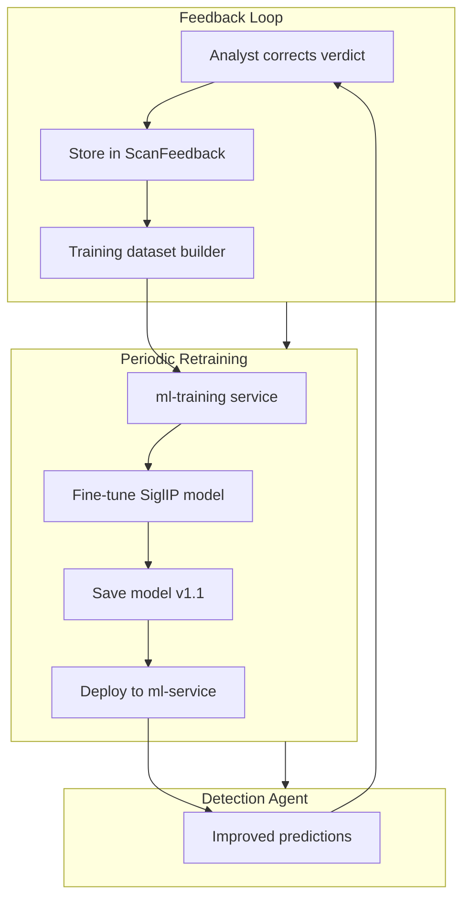

# Self-Learning via Periodic Model Retraining

## Goal

Enable the 4-agent pipeline to improve over time by:

1. Collecting human corrections when analysts disagree with verdicts
2. Periodically fine-tuning the Detection Agent's image model on corrected samples
3. Deploying the fine-tuned model for improved future predictions

## Architecture




---

## Phase 1: Feedback Collection

### 1.1 Database Schema

Add a new collection **ScanFeedback** (or extend Scan schema):

**Option A - New collection** (recommended for clean separation):

- `scanId` (FK to Scan)
- `originalVerdict`, `correctedVerdict` (DEEPFAKE | SUSPICIOUS | AUTHENTIC)
- `correctedBy` (userId), `correctedAt` (Date)
- `notes` (optional analyst comment)

**Option B - Extend Scan**:
Add to [backend/src/scans/scan.model.js](backend/src/scans/scan.model.js):

```javascript
feedback: {
  correctedVerdict: { type: String, enum: ['DEEPFAKE','SUSPICIOUS','AUTHENTIC'] },
  correctedBy: { type: ObjectId, ref: 'User' },
  correctedAt: Date,
  notes: String
}
```

### 1.2 Backend API

- **POST** `/api/scans/:id/feedback` - Submit correction (Analyst/Admin only)
  - Body: `{ correctedVerdict, notes? }`
  - Validate: scan exists, status=COMPLETED, correctedVerdict differs from result.verdict
  - Audit log the action
- **GET** `/api/scans/:id` - Include `feedback` in response if present
- **GET** `/api/admin/feedback/stats` - Count of feedback entries for retraining eligibility

### 1.3 Frontend UI

- **Scan detail / Evidence vault view**: Add "Correct verdict" button (Analyst/Admin)
  - Modal: dropdown (DEEPFAKE / SUSPICIOUS / AUTHENTIC) + optional notes
  - Call `POST /api/scans/:id/feedback`
- **Admin ML page** ([app/admin/ml/page.tsx](app/admin/ml/page.tsx)): Show feedback count, "Retraining" section ( Phase 2)

### 1.4 Frame Persistence for Training

**Problem**: Frames in `uploads/processing/{scanId}/frames/` may be cleaned up. Training needs image files.

**Solution**: When feedback is submitted, copy representative frames to a persistent training dataset directory:

- Path: `uploads/training_dataset/real/` and `uploads/training_dataset/fake/`
- For IMAGE: copy the single frame
- For VIDEO: copy 1-5 sampled frames (e.g., every Nth frame)
- Naming: `{scanId}_{frameIndex}.jpg` to avoid collisions
- Store mapping in ScanFeedback or a `TrainingSample` collection: `{ scanId, framePaths[], label }`

**Alternative (lighter)**: Don't copy immediately. At training time, re-extract frames from original file (`scan.filePath`) for scans with feedback. Requires original files to still exist.

---

## Phase 2: ml-training Service

### 2.1 Directory Structure

Create `ml-training/` at project root:

```
ml-training/
├── requirements.txt      # torch, transformers, datasets, accelerate
├── config.py             # Paths, hyperparams, model ID
├── dataset_builder.py    # Query MongoDB for feedback, build HF Dataset
├── train.py              # Main fine-tuning script
├── export_model.py       # Export to ml-service format
└── README.md             # Run instructions (local, Colab, Docker)
```

### 2.2 Dataset Builder

- Connect to MongoDB (reuse `MONGODB_URI` or training-specific env)
- Query: scans with `feedback.correctedVerdict` (or ScanFeedback collection)
- For each: get `filePath` or `processingData.perception.extractedFrames`
- Build dataset: `{"image": path, "label": 0|1}` (0=real, 1=fake)
- Map verdicts: AUTHENTIC=0, DEEPFAKE=1, SUSPICIOUS=0 or 1 (or exclude from training)
- Split: 90% train, 10% validation
- Use HuggingFace `datasets` with `load_dataset("imagefolder", ...)` or custom `Dataset`

### 2.3 Fine-Tuning Script

- Load base model: `prithivMLmods/deepfake-detector-model-v1` (same as inference)
- Use `transformers.Trainer` with:
  - Small learning rate: 2e-5 to 5e-5
  - Batch size: 8-16 (GPU) or 4 (CPU)
  - Epochs: 2-5 (early stop if overfitting)
  - Mixed precision (fp16) if GPU
- Export to `ml-service/model_finetuned/` or versioned path `model_v1.1/`
- Same format as current model: `config.json`, `model.safetensors`, `preprocessor_config.json`

### 2.4 Model Deployment

- **Option A**: Training script writes to `ml-service/model/` (overwrite). ml-service loads from `/app/model`. Restart ml-service container to pick up new model.
- **Option B**: Versioned models (`model_v1.0`, `model_v1.1`). Add env `MODEL_VERSION=v1.1` to ml-service; model_loader checks env and loads corresponding path.
- **Option C**: Admin triggers "Deploy model" after training; backend copies `model_finetuned/` to `model/` and sends SIGHUP or restarts ml-service (requires orchestration).

Recommend **Option A** for simplicity: training outputs to `ml-service/model/`, admin manually restarts ml-service after validating training metrics.

---

## Phase 3: Retraining Trigger & Admin UX

### 3.1 Backend Trigger

- **POST** `/api/admin/ml/retrain` - Initiate retraining (Admin only)
  - Check: minimum feedback count (e.g., 50 samples)
  - Option 1: Queue a background job (Bull/Redis) that runs `python ml-training/train.py`
  - Option 2: Return instructions + script path; admin runs manually or via cron
  - Log audit event

### 3.2 Training Job Options


| Mode          | When                   | How                                                                                                                                                                 |
| ------------- | ---------------------- | ------------------------------------------------------------------------------------------------------------------------------------------------------------------- |
| **Manual**    | Admin clicks "Retrain" | Backend spawns child process or admin runs `python ml-training/train.py` locally                                                                                    |
| **Scheduled** | Weekly/Monthly         | Cron job or Kubernetes CronJob runs `train.py`                                                                                                                      |
| **Colab**     | On-demand              | Provide Colab notebook that connects to MongoDB, downloads feedback metadata, trains, uploads model to GDrive/S3; admin downloads and places in `ml-service/model/` |


### 3.3 Admin ML Page Enhancements

- Feedback stats: "X scans with analyst corrections"
- "Start retraining" button (if job runner) or "Download training script / Open Colab" link
- Retraining history/status (optional): last run, epochs, accuracy on val set

---

## Phase 4: Audio Model (Optional)

The current system also has an audio model (wav2vec2). To extend self-learning to audio:

- Store audio path in feedback flow (`extractedAudio` or re-extract)
- Add `ml-training/train_audio.py` for fine-tuning wav2vec2 on corrected audio samples
- Same feedback schema can include `mediaType`; dataset builder branches for IMAGE vs AUDIO

Defer to a later phase if scope is limited initially.

---

## Key Files to Create/Modify


| File                                                                          | Action                                                  |
| ----------------------------------------------------------------------------- | ------------------------------------------------------- |
| [backend/src/scans/scan.model.js](backend/src/scans/scan.model.js)            | Add `feedback` subdocument or create ScanFeedback model |
| [backend/src/scans/scan.controller.js](backend/src/scans/scan.controller.js)  | Add `submitFeedback`, ensure RBAC                       |
| [backend/src/scans/scan.routes.js](backend/src/scans/scan.routes.js)          | Add `POST /:id/feedback`                                |
| [lib/api.ts](lib/api.ts)                                                      | Add `submitScanFeedback(id, data)`                      |
| [components/evidence-vault.tsx](components/evidence-vault.tsx) or scan-detail | Add "Correct verdict" UI                                |
| [app/admin/ml/page.tsx](app/admin/ml/page.tsx)                                | Feedback stats, retrain trigger                         |
| `ml-training/dataset_builder.py`                                              | New - build HF dataset from feedback                    |
| `ml-training/train.py`                                                        | New - fine-tune SiglIP                                  |
| `ml-training/config.py`                                                       | New - paths, hyperparams                                |
| [ml-service/model_loader.py](ml-service/model_loader.py)                      | Optional: support `MODEL_PATH` env for versioned load   |
| [docker-compose.yml](docker-compose.yml)                                      | Optional: add ml-training service for running jobs      |


---

## Minimum Viable Scope

For an academic/MVP delivery:

1. **Phase 1** (Feedback): Schema + API + "Correct verdict" button on scan detail
2. **Phase 2** (Training): `ml-training/train.py` that reads feedback from MongoDB, builds dataset, fine-tunes, saves to `ml-service/model/`
3. **Phase 3** (Trigger): Admin page with feedback count + link to run `train.py` (manual run doc)
4. Defer: Background job, Colab notebook, audio model, sophisticated model versioning

---

## Risks and Mitigations


| Risk                     | Mitigation                                                                  |
| ------------------------ | --------------------------------------------------------------------------- |
| Too few feedback samples | Require minimum (e.g., 50) before training; show "Need X more" in admin     |
| Catastrophic forgetting  | Use low LR (2e-5), few epochs (2-3), optional replay buffer from base model |
| Original files deleted   | Copy frames to training dataset at feedback time                            |
| GPU not available        | Support CPU training (slower); provide Colab notebook for cloud GPU         |


