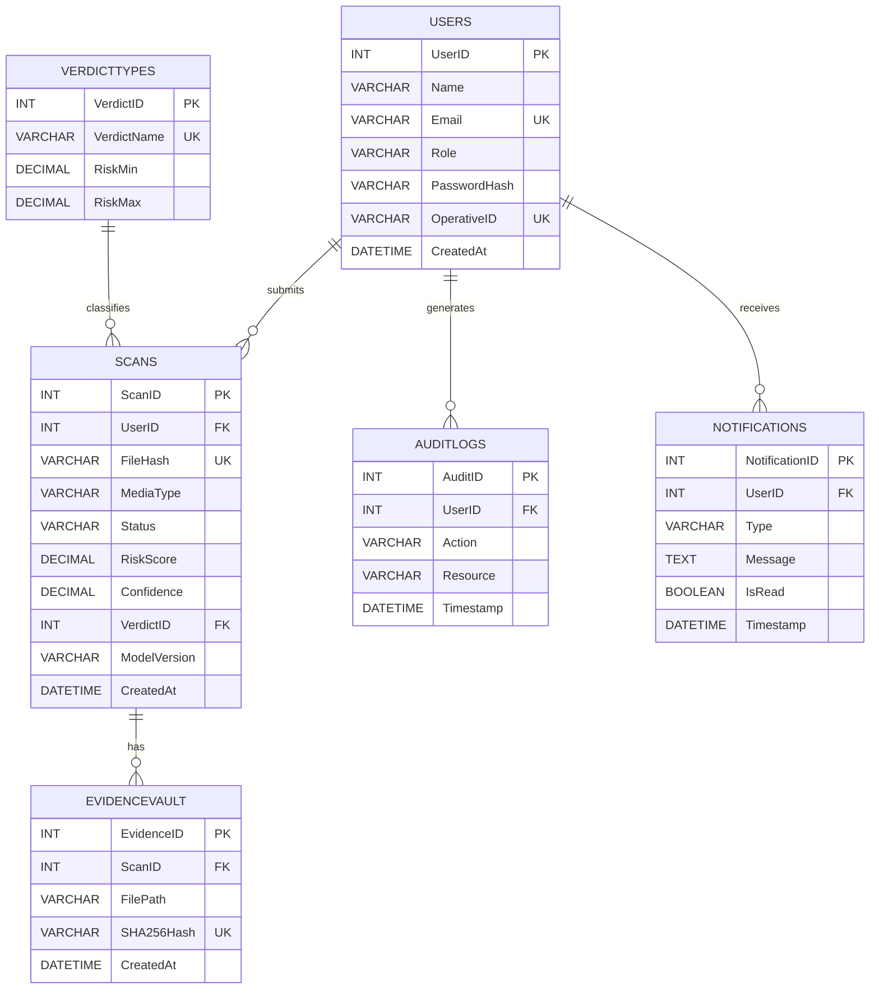

# SENTINEL — Entity Relationship Diagram

## UCS310 — Database Management System

---

## Entities & Attributes

### Users
| Column | Type | Constraint |
|--------|------|-----------|
| **UserID** | INT | PK, AUTO_INCREMENT |
| Name | VARCHAR(100) | NOT NULL |
| Email | VARCHAR(255) | UNIQUE, NOT NULL |
| Role | VARCHAR(20) | CHECK (admin/operative/analyst) |
| PasswordHash | VARCHAR(255) | NOT NULL |
| OperativeID | VARCHAR(20) | UNIQUE, NOT NULL |
| CreatedAt | DATETIME | DEFAULT NOW() |

### Scans
| Column | Type | Constraint |
|--------|------|-----------|
| **ScanID** | INT | PK, AUTO_INCREMENT |
| UserID | INT | FK → Users.UserID |
| FileHash | VARCHAR(64) | UNIQUE, NOT NULL |
| MediaType | VARCHAR(10) | CHECK (VIDEO/AUDIO/IMAGE/UNKNOWN) |
| Status | VARCHAR(15) | CHECK (PENDING/PROCESSING/COMPLETED/FAILED) |
| RiskScore | DECIMAL(5,2) | CHECK 0–100, nullable |
| Confidence | DECIMAL(5,2) | CHECK 0–100, nullable |
| VerdictID | INT | FK → VerdictTypes.VerdictID |
| ModelVersion | VARCHAR(20) | nullable |
| CreatedAt | DATETIME | DEFAULT NOW() |

### VerdictTypes *(lookup / reference table)*
| Column | Type | Constraint |
|--------|------|-----------|
| **VerdictID** | INT | PK, AUTO_INCREMENT |
| VerdictName | VARCHAR(20) | UNIQUE — DEEPFAKE/SUSPICIOUS/AUTHENTIC |
| RiskMin | DECIMAL(5,2) | NOT NULL |
| RiskMax | DECIMAL(5,2) | NOT NULL |

### AuditLogs
| Column | Type | Constraint |
|--------|------|-----------|
| **AuditID** | INT | PK, AUTO_INCREMENT |
| UserID | INT | FK → Users.UserID |
| Action | VARCHAR(100) | NOT NULL |
| Resource | VARCHAR(100) | NOT NULL |
| Timestamp | DATETIME | DEFAULT NOW() |

### Notifications
| Column | Type | Constraint |
|--------|------|-----------|
| **NotificationID** | INT | PK, AUTO_INCREMENT |
| UserID | INT | FK → Users.UserID |
| Type | VARCHAR(50) | CHECK (scan_complete/deepfake_detected/...) |
| Message | TEXT | NOT NULL |
| IsRead | BOOLEAN | DEFAULT FALSE |
| Timestamp | DATETIME | DEFAULT NOW() |

### EvidenceVault
| Column | Type | Constraint |
|--------|------|-----------|
| **EvidenceID** | INT | PK, AUTO_INCREMENT |
| ScanID | INT | FK → Scans.ScanID |
| FilePath | VARCHAR(500) | NOT NULL |
| SHA256Hash | VARCHAR(64) | UNIQUE, NOT NULL |
| CreatedAt | DATETIME | DEFAULT NOW() |

---

## Relationships (Crow's Foot Notation)

```
Users ||--o{ Scans          : "submits"       (1 user → many scans)
Users ||--o{ AuditLogs      : "generates"     (1 user → many audit events)
Users ||--o{ Notifications  : "receives"      (1 user → many notifications)
Scans ||--o{ EvidenceVault  : "has"           (1 scan → many evidence files)
VerdictTypes ||--o{ Scans   : "classifies"    (1 verdict type → many scans)
```

## ER Diagram (Updated Visual)



### Cardinalities
| Relationship | Cardinality | Explanation |
|---|---|---|
| Users → Scans | 1 : M | One user submits many scans |
| Users → AuditLogs | 1 : M | Every user action creates a log |
| Users → Notifications | 1 : M | User receives multiple notifications |
| Scans → EvidenceVault | 1 : M | One scan can have multiple evidence files |
| VerdictTypes → Scans | 1 : M | One verdict type applies to many scans |

---

## ER Diagram (Text Representation)

```
┌─────────────────────────┐
│         Users           │
├─────────────────────────┤
│ PK  UserID              │
│     Name                │
│     Email (UNIQUE)      │
│     Role                │
│     PasswordHash        │
│     OperativeID (UNIQUE)│
│     CreatedAt           │
└────────┬────────────────┘
         │ 1
         │
    ─────┼──────────────────────────────────────────
    |    │ M                  M │          M │
    │    ▼                     ▼            ▼
    │ ┌──────────────┐  ┌─────────────┐ ┌──────────────────┐
    │ │   Scans      │  │  AuditLogs  │ │  Notifications   │
    │ ├──────────────┤  ├─────────────┤ ├──────────────────┤
    │ │ PK ScanID    │  │ PK AuditID  │ │ PK NotificationID│
    │ │ FK UserID    │  │ FK UserID   │ │ FK UserID        │
    │ │    FileHash  │  │    Action   │ │    Type          │
    │ │    MediaType │  │    Resource │ │    Message       │
    │ │    Status    │  │    Timestamp│ │    IsRead        │
    │ │    RiskScore │  └─────────────┘ │    Timestamp     │
    │ │    Confidence│                  └──────────────────┘
    │ │ FK VerdictID │
    │ │    ModelVer  │
    │ │    CreatedAt │
    │ └──────┬───┬───┘
    │        │   │ 1
    │        │ M │
    │        │   ▼
    │        │ ┌──────────────────┐
    │        │ │   EvidenceVault  │
    │        │ ├──────────────────┤
    │        │ │ PK EvidenceID    │
    │        │ │ FK ScanID        │
    │        │ │    FilePath      │
    │        │ │    SHA256Hash    │
    │        │ │    CreatedAt     │
    │        │ └──────────────────┘
    │        │
    │        │ M
    │        ▼
    │   ┌──────────────────┐
    │   │   VerdictTypes   │
    │   ├──────────────────┤
    │   │ PK VerdictID     │
    │   │    VerdictName   │
    │   │    RiskMin       │
    │   │    RiskMax       │
    │   └──────────────────┘
```

---

## Normalization Proof

### Before Normalization (Unnormalized Scans table)
```
Scans(ScanID, UserID, UserName, UserRole, FileHash, MediaType, Status,
      RiskScore, VerdictName, RiskMin, RiskMax, ModelVersion, CreatedAt)
```

**Problems:**
- `UserName`, `UserRole` repeated for every scan by same user (redundancy)
- `RiskScore → VerdictName → RiskMin, RiskMax` (transitive dependency)

### After 1NF
- All attributes atomic, no repeating groups ✓
- Removed embedded arrays/lists ✓

### After 2NF
- Single-column PKs throughout, so no partial dependencies possible ✓

### After 3NF
- Extracted `VerdictTypes(VerdictID, VerdictName, RiskMin, RiskMax)` table
- `Scans.VerdictID` is now a FK — no transitive dependency on RiskScore ✓
- User attributes moved to `Users` table — no transitive dep through UserID ✓

### BCNF
- Every determinant in every table is a candidate key:
  - `VerdictTypes`: VerdictID → all (PK), VerdictName → all (UNIQUE)
  - `Users`: UserID → all (PK), Email → all (UNIQUE), OperativeID → all (UNIQUE)
  - All other tables: single-column PK, no overlapping candidate keys ✓
