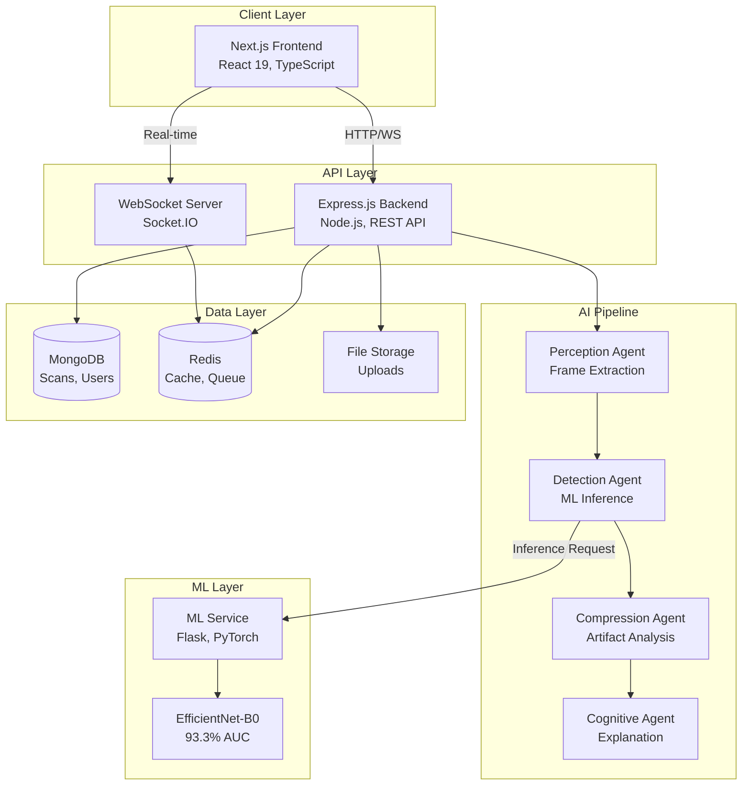
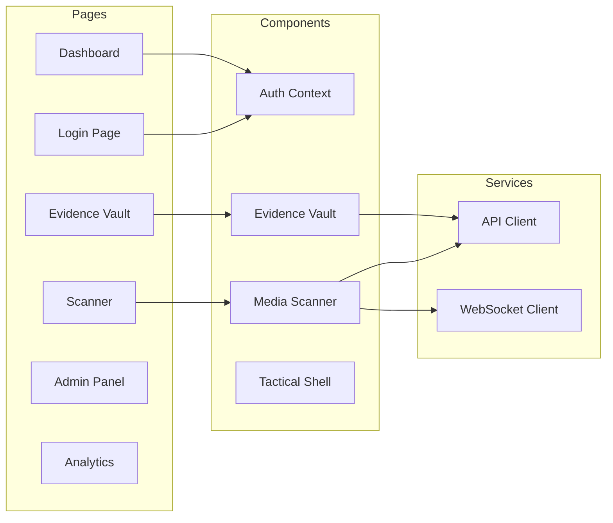
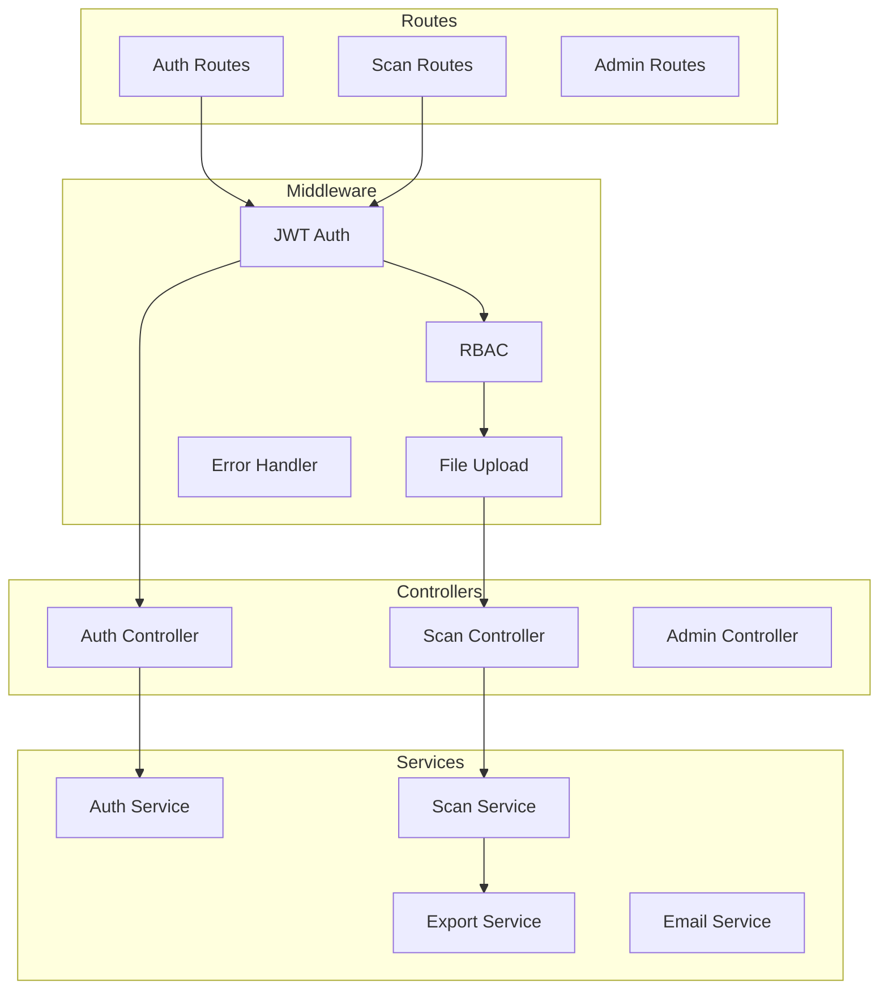
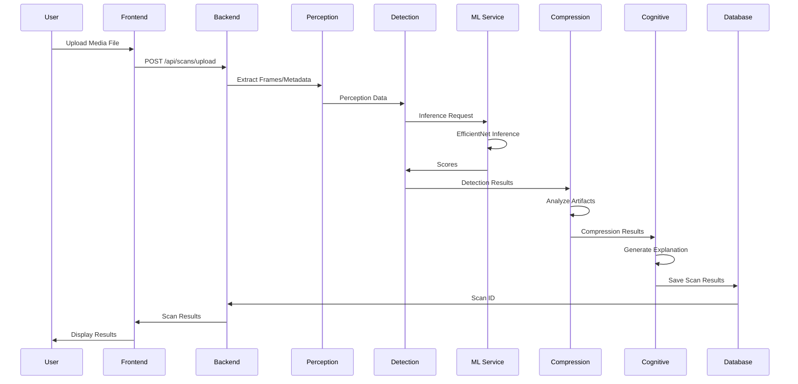
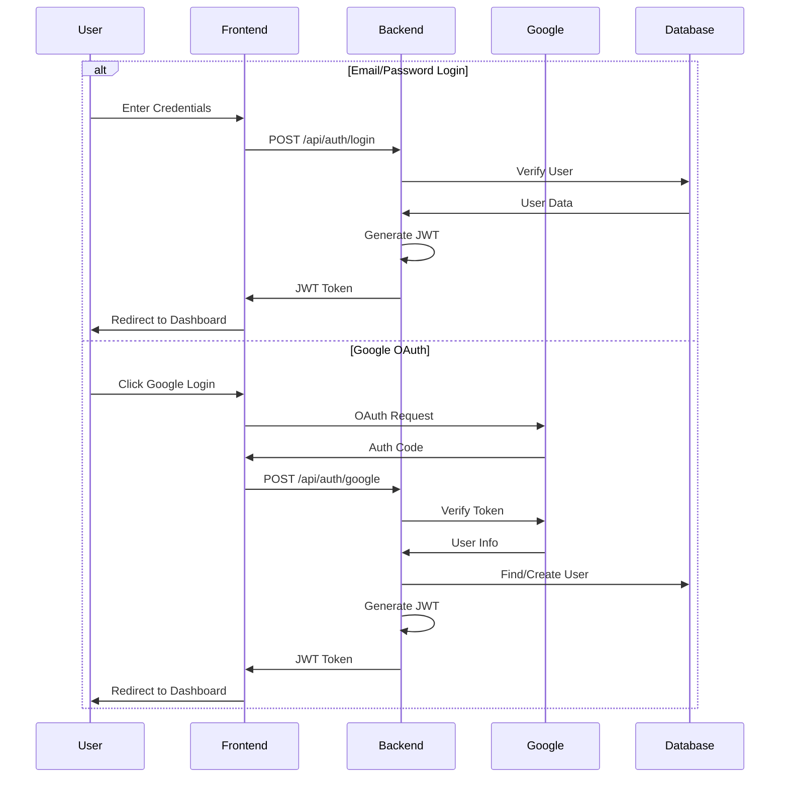
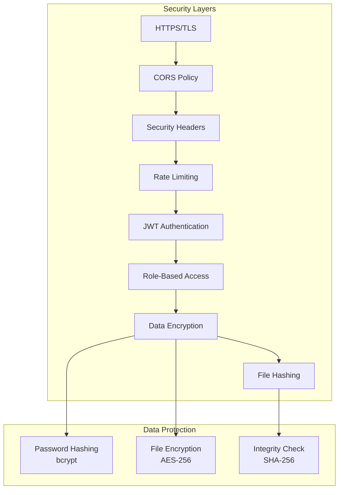
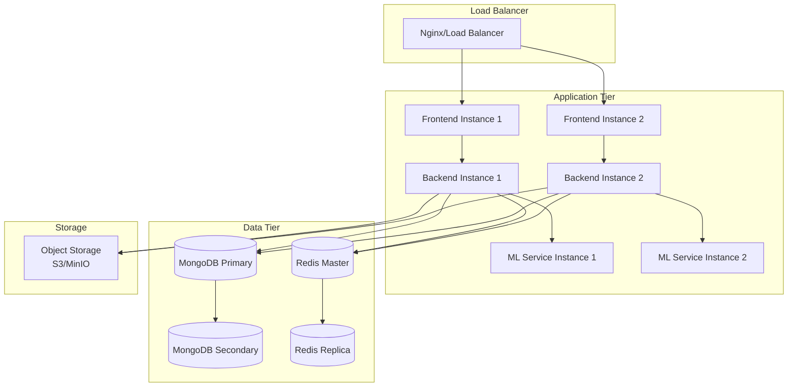

# System Architecture

## Overview

The Deepfake Detection & Authenticity Verification System is a full-stack application that uses machine learning to detect manipulated media files. The system employs a 4-agent AI pipeline for comprehensive analysis.

## Architecture Diagram

## Component Architecture

### Frontend (Next.js)

### Backend (Express.js)

## Data Flow

### Scan Processing Flow

### Authentication Flow

## Security Architecture

## Deployment Architecture

## Technology Stack

### Frontend
- **Framework**: Next.js 16 (React 19)
- **Language**: TypeScript
- **Styling**: Tailwind CSS
- **UI Components**: Radix UI
- **State Management**: React Context
- **Real-time**: Socket.IO Client

### Backend
- **Runtime**: Node.js 20
- **Framework**: Express.js
- **Database**: MongoDB 7.0
- **Cache**: Redis (optional)
- **Queue**: Bull (optional)
- **Authentication**: JWT, Google OAuth
- **File Processing**: FFmpeg, Multer
- **Logging**: Winston

### ML Service
- **Language**: Python 3.10
- **Framework**: Flask
- **ML Framework**: PyTorch
- **Model**: EfficientNet-B0
- **Image Processing**: Pillow, OpenCV

### DevOps
- **Containerization**: Docker
- **Orchestration**: Docker Compose / Kubernetes
- **CI/CD**: GitHub Actions
- **Monitoring**: Prometheus, Grafana
- **Logging**: ELK Stack (optional)

## Scalability Considerations

### Horizontal Scaling
- **Frontend**: Stateless, can run multiple instances
- **Backend**: Stateless API, load balanced
- **ML Service**: CPU/GPU intensive, parallel processing
- **Database**: MongoDB replica set for read scaling

### Vertical Scaling
- **ML Service**: Increase CPU/GPU resources
- **Database**: Increase RAM for better caching
- **Backend**: Increase memory for concurrent requests

### Performance Optimization
- **Caching**: Redis for frequently accessed data
- **CDN**: Static assets served from CDN
- **Database Indexing**: Optimized queries
- **Code Splitting**: Lazy loading in frontend
- **Image Optimization**: Next.js image optimization

## Monitoring and Observability

### Metrics
- Request rate and latency
- Error rates
- ML inference time
- Database query performance
- Memory and CPU usage

### Logging
- Application logs (Winston)
- Access logs (Nginx)
- Error tracking (Sentry)
- Audit logs (Database)

### Alerts
- Service downtime
- High error rates
- Resource exhaustion
- Security incidents
